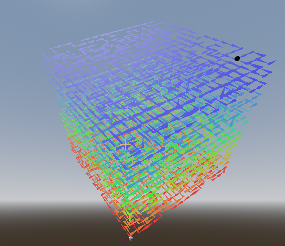
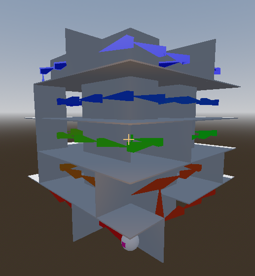
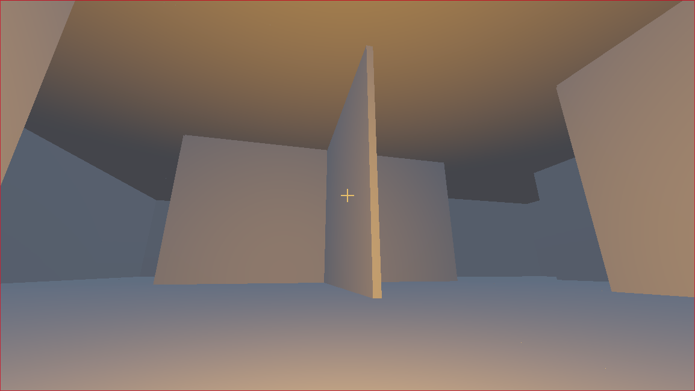

# Polyrinthes - Addon
## What it does
Polyrinthe uses DFS to create 3D mazes using a generated seed.
 
## How to use
- On hierarchy add a `Polyrinthe` node.
- Set the the settings you want in inspector.
	- The first marker3D should be the center of the bottom left front room of the cube.
	- The `right` one shows the right then you face the cube.
	- The `up` one shows the upper direction when you face the cube.
- Now you can call `generate(sizeP:int, new_seed:String = "")` to generate the maze.
	- size corresponds to the number of room on an edge.
	- new_seed corresponds to the seed you want to use for the generation, empty or missing means a new one is automatically generated.
- Then you can call display to display the actual maze.
- Don't forget to call `clean()` when you need multiple call to `generate() -> display()`.
- Tags can be used to add specificities to rooms.

## Examples:
Debug mode using a size of 15, without walls, generation layer by layer.
Markers: First: (0, 0, 0), Right: (1, 0.707107, 0.707107), Up: (**-1**, 0.707107, 0.707107).

  

Debug mode using a size of 5, with walls, without outWalls (-2).
Markers: First: (0, 0, 0), Right: (1, 0, 0), Up: (0, 1, 0).

  

Normal mode using a size of 5, with walls, with a scale of 2.
Markers: First: (0, 0, 0), Right: (1, 0.707107, 0.707107), Up: (**-1**, 0.707107, 0.707107).

  

