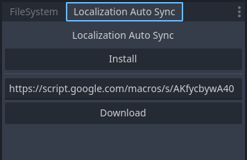
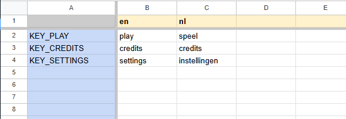

# Localization Auto Sync for Godot

**Streamline your localization workflow by connecting Godot directly to Google Sheets.**

This plugin allows you to manage your game's translations in a collaborative Google Sheet and sync them to your Godot project with a single click. No more manual CSV downloading or messy file imports—let your translators work in the cloud, and update your game instantly.

## ✨ Features

* **One-Click Sync:** Download and import translations directly from the editor dock.
* **Automated Setup:** Automatically updates Godot's Project Settings/Localization tab.
* **Collaborative:** Works with Google Sheets, making it easy to share with translators or localization teams.
* **Zero Friction:** No complex OAuth setups required for the end-user.

---

## 🛠️ Installation

1. Download this repository or install via the **Godot Asset Library**.
2. Copy the `addons/localization_sync` (or your folder name) folder into your project's `addons/` directory.
3. Go to **Project > Project Settings > Plugins**.
4. Enable **Localization Auto Sync**.

---

## 🚀 Setup Guide

Once enabled, you will see a new dockable window in the editor titled **Localization Auto Sync**.

### Step 1: Create the Spreadsheet
1. In the Localization Auto Sync dock, click the **Install** button.
2. This will open your web browser and ask you to **Make a Copy** of the template Google Sheet.
3. Click **Make a copy** to save it to your own Google Drive.

### Step 2: Deploy the Web App
*This step allows Godot to talk to your spreadsheet.*

1. In your new Google Sheet, look at the top menu and select **Extensions > Apps Script**.
2. A new tab will open showing the script editor. Click the blue **Deploy** button in the top right, then select **New deployment**.
3. Click the **gear icon (⚙️)** next to "Select type" and choose **Web App**.
4. **Crucial Configuration:**
    * **Description:** (Optional, e.g., "Godot Sync")
    * **Execute as:** Set to **Me (your_email@gmail.com)**.
    * **Who has access:** Set to **Anyone**.
    * *Note: "Anyone" is required so Godot can read the data without needing a complex login window every time. The data is read-only for the engine.*
5. Click **Deploy**.
6. Grant access/authorize the script if Google asks.

### Step 3: Connect to Godot
1. Once deployed, Google will show you a window with a **Web app URL**.
2. **Copy** this URL.
3. Go back to Godot.
4. Paste the URL into the text field (Google Web App URL) in the **Localization Auto Sync** dock.

---

## 📝 Usage

### Adding Translations
1. Open your Google Sheet.
2. Add your translation keys (e.g., `KEY_GREETING`) in the first column.
3. Add language codes (e.g., `en`, `es`, `fr`) in the top row.
4. Fill in the cells.

### Updating the Game
1. In the Godot Editor, go to the **Localization Auto Sync** dock.
2. Click the **Download** button.
3. The plugin will fetch the latest data, create/update the translation files, and register them in your Project Settings automatically.

---

## License

[MIT License](LICENSE.md)
